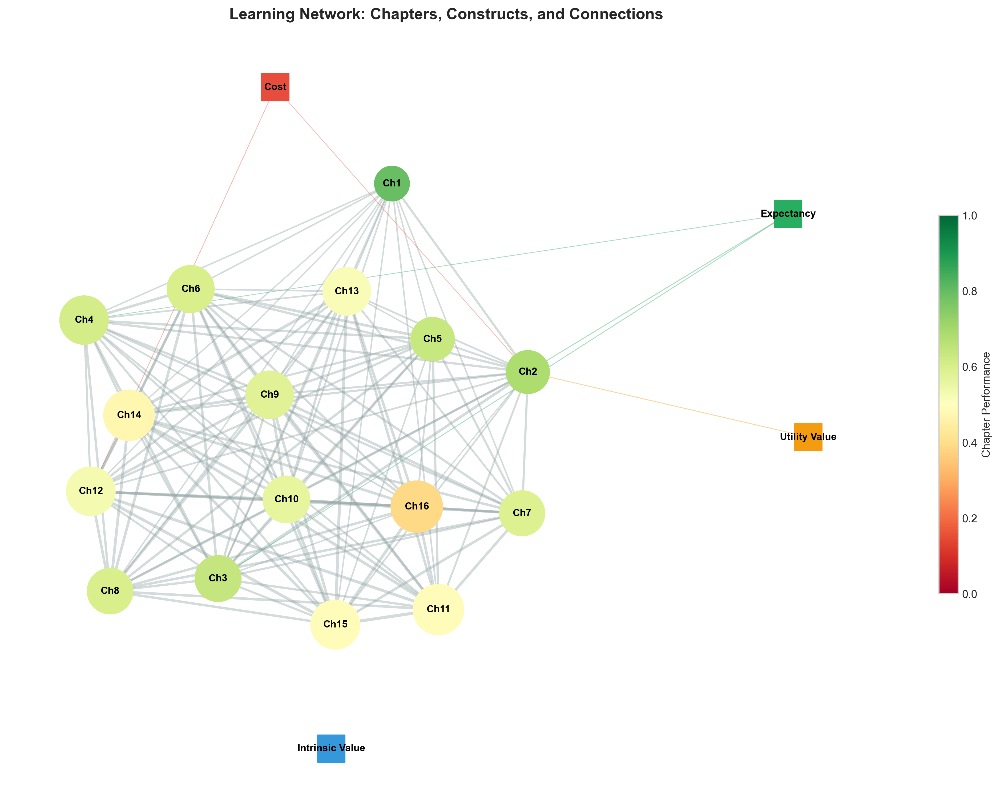
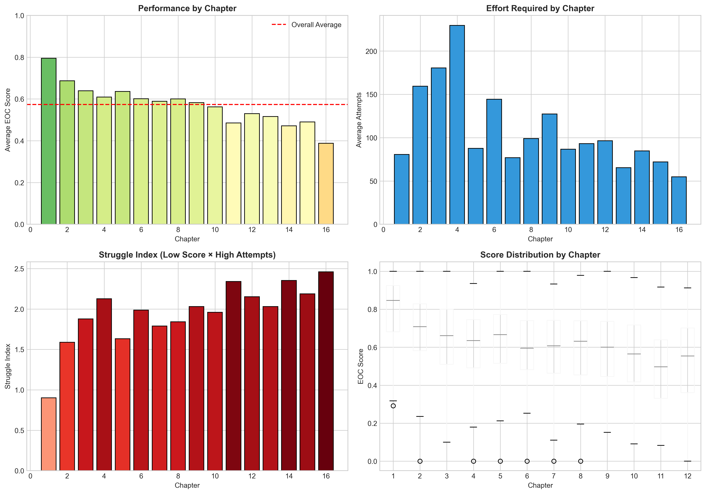
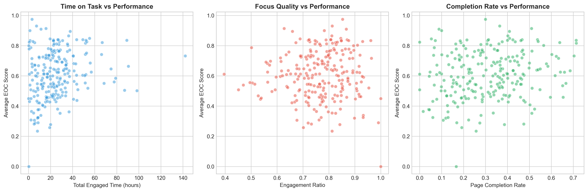
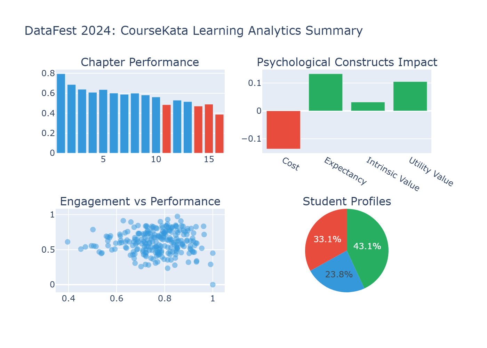

# ASA DataFest 2024: Decoding the Psychology of Statistical Learning

> **Analyzing CourseKata's Educational Platform Data to Identify What Drives Student Success**

[](https://www.python.org/downloads/)
[](https://opensource.org/licenses/MIT)

## Overview

This project analyzes student learning data from **CourseKata**, an interactive online statistics education platform used across 11 universities with 1,600+ students. The analysis was conducted as part of the [ASA DataFest 2024](https://ww2.amstat.org/education/datafest/) competition, where teams explored how psychological factors and engagement patterns predict student success in introductory statistics courses.

### Key Research Questions
1. How do psychological constructs (motivation, self-efficacy, perceived value) predict academic performance?
2. Which chapters in the curriculum are "stumbling blocks" where students struggle most?
3. Can we identify distinct student behavioral profiles to enable targeted interventions?

---

## Key Findings

### 1. Expectancy (Self-Efficacy) is the Strongest Predictor of Success
Students who believe they *can* succeed actually *do* succeed. Among the four psychological constructs measured:

| Construct | Correlation with Performance | Interpretation |
|-----------|------------------------------|----------------|
| **Expectancy** | r = 0.133 | Strongest positive predictor |
| Intrinsic Value | r = 0.089 | Moderate positive effect |
| Utility Value | r = 0.071 | Weak positive effect |
| Cost | r = -0.045 | Negative (high perceived cost hurts) |

**Implication:** Early interventions should focus on building student confidence through achievable early wins.

### 2. Identified Stumbling Block Chapters
Three chapters emerged as critical points where students struggle most:

| Chapter | Avg Score | Avg Attempts | Struggle Index |
|---------|-----------|--------------|----------------|
| Chapter 16 | 38.8% | 54.8 | Highest |
| Chapter 14 | 47.1% | 84.6 | High |
| Chapter 11 | 48.5% | 93.1 | High |

**Implication:** These chapters need pedagogical review - additional scaffolding, worked examples, or prerequisite reinforcement.

### 3. Four Distinct Student Behavioral Profiles

Using K-means clustering on engagement and performance metrics, we identified four student types:

| Profile | Students | Avg Score | Characteristics |
|---------|----------|-----------|-----------------|
| **High Performers** | 79 | 75.7% | High engagement, high completion |
| **Passive Completers** | 103 | 58.4% | Complete work but low engagement |
| **Struggling Students** | 57 | 44.1% | Low scores despite attempts |
| **Engaged Learners** | ~50 | ~65% | High engagement, moderate scores |

**Implication:** Early identification of "Struggling Students" enables proactive support before they fall behind.

---

## Visualizations

### Force-Directed Learning Network
Interactive network showing relationships between chapters and psychological constructs:
- **Node color:** Performance (green = high, red = low)
- **Node size:** Struggle index (larger = more difficult)
- **Edges:** Correlations between chapters and construct impacts



### Chapter Difficulty Analysis


### Psychological Constructs Impact


### Student Engagement vs Performance


### Summary Dashboard


---

## Interactive Visualizations

Open these HTML files in a browser for interactive exploration:

| File | Description |
|------|-------------|
| [`outputs/learning_network.html`](outputs/learning_network.html) | Force-directed network graph |
| [`outputs/student_clusters_interactive.html`](outputs/student_clusters_interactive.html) | PCA cluster visualization |
| [`outputs/summary_dashboard.html`](outputs/summary_dashboard.html) | Multi-panel interactive dashboard |

---

## Dataset

The analysis uses CourseKata's anonymized learning data:

| Dataset | Records | Description |
|---------|---------|-------------|
| `responses.csv` | ~7M | Individual quiz/exercise responses |
| `page_views.csv` | ~479K | Page access with engagement metrics |
| `checkpoints_pulse.csv` | ~77K | Mid-chapter motivation surveys |
| `checkpoints_eoc.csv` | ~2.5K | End-of-chapter assessment scores |
| `media_views.csv` | ~6K | Video viewing behavior |

**Note:** Raw data files are excluded from the repository due to size. The analysis uses a stratified sample for demonstration.

---

## Project Structure

```
DataFest-2024/
├── README.md                 # This file
├── analysis.ipynb            # Jupyter notebook with full analysis
├── requirements.txt          # Python dependencies
├── .gitignore               # Git ignore rules
├── src/
│   └── analysis.py          # Standalone analysis script
├── outputs/                  # Generated visualizations
│   ├── chapter_difficulty.png
│   ├── construct_correlations.png
│   ├── engagement_performance.png
│   ├── learning_network.html
│   ├── learning_network_static.png
│   ├── student_clusters_interactive.html
│   └── summary_dashboard.html
└── Data/
    ├── Documentation/        # Data codebook and variable list
    └── Random Sample of Data Files/  # Sample data for testing
```

---

## Getting Started

### Prerequisites
- Python 3.11+
- pip

### Installation

```bash
# Clone the repository
git clone https://github.com/YOUR_USERNAME/datafest-2024.git
cd datafest-2024

# Install dependencies
pip install -r requirements.txt
```

### Running the Analysis

**Option 1: Jupyter Notebook (Recommended)**
```bash
jupyter notebook analysis.ipynb
```

**Option 2: Python Script**
```bash
python src/analysis.py
```

---

## Methodology

### Psychological Constructs (Expectancy-Value Theory)
CourseKata measures four constructs based on educational psychology research:
- **Expectancy:** "I can succeed at this" (self-efficacy)
- **Intrinsic Value:** "This is interesting" (inherent interest)
- **Utility Value:** "This is useful" (practical relevance)
- **Cost:** "This is too hard/time-consuming" (perceived barriers)

### Struggle Index
We developed a composite metric to identify difficult chapters:
```
Struggle Index = (1 - avg_score) × log(1 + avg_attempts)
```
This captures both low performance AND high effort, indicating genuine difficulty rather than just low engagement.

### Student Clustering
K-means clustering (k=4) on standardized features:
- Engagement ratio (engaged time / total time)
- Page completion rate
- Average EOC score
- Total attempts

---

## Actionable Recommendations

Based on our analysis, we recommend:

1. **Build Early Confidence:** Design the first 2-3 chapters to maximize early success, boosting expectancy beliefs.

2. **Redesign Stumbling Blocks:** Chapters 11, 14, and 16 need additional:
   - Worked examples
   - Scaffolded practice problems
   - Prerequisite review materials

3. **Early Warning System:** Flag students showing "Struggling Student" patterns by week 3 for proactive intervention.

4. **Engagement Nudges:** Students with low engagement ratios but reasonable completion could benefit from gamification or social features.

---

## About ASA DataFest

[ASA DataFest](https://ww2.amstat.org/education/datafest/) is a data analysis competition where teams of undergraduates work over a weekend to analyze a large, complex dataset. The 2024 challenge featured CourseKata data, with winning teams from Duke, UCLA, and other universities developing innovative approaches to improve online statistics education.

---

## Acknowledgments

- **CourseKata** for providing the educational platform data
- **American Statistical Association** for organizing DataFest
- Winning team approaches that inspired this analysis:
  - Duke University: Adaptive learning behavior models
  - UCLA: Feedback recommendation engines

---

## License

This project is licensed under the MIT License - see the [LICENSE](LICENSE) file for details.

---

*Created for ASA DataFest 2024*
